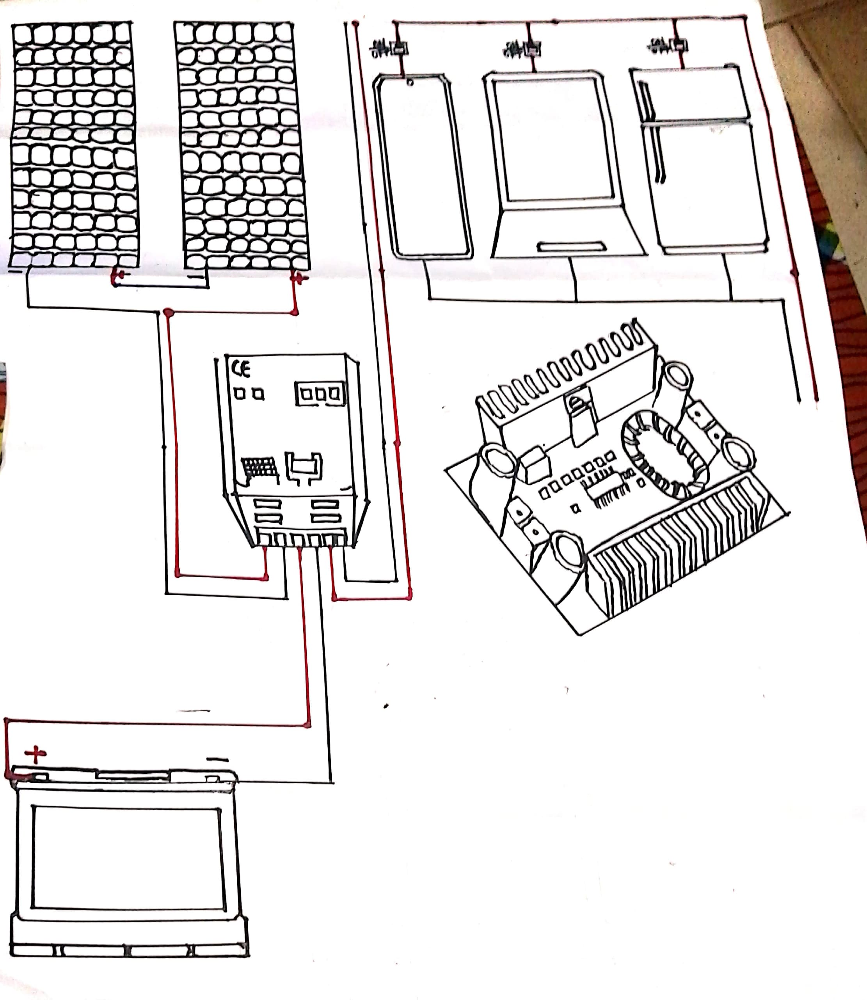
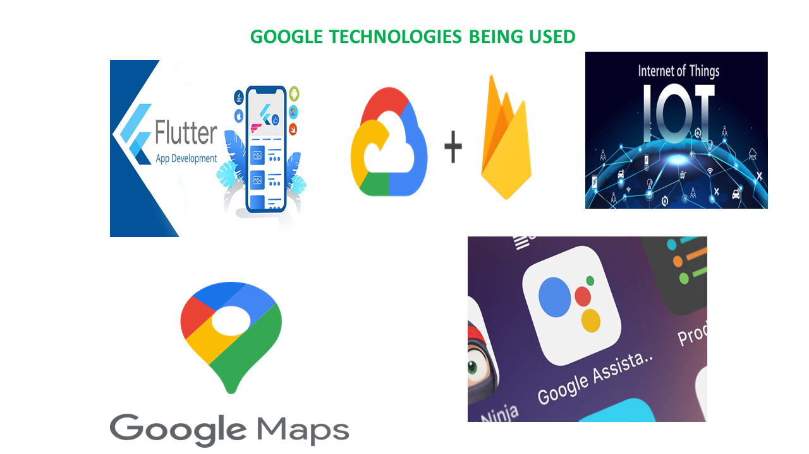

# NetXus.
NetXus is an innovative hardware solution integrating solar and wind energy to charge devices and power homes, complemented by an IoT system enabling personalized configurations via password protection and remote control via Google Assistant. Utilizing Flutter, the project offers a user-friendly interface displaying real-time battery levels on Google Firebase, while integrating a Google Maps feature to showcase the locations of nearby installations, enhancing accessibility and monitoring capabilities.

#### Download NetXus APK - [here](https://drive.google.com/file/d/1wZOmiFl_mioffmtH6t7KhAUHmm3-q5hQ/view?usp=sharing)

## Project Structure
The project consists of two main components:

* Mobile-app: This app contains the code for the NetXus mobile app. It is built using the Flutter framework, and allows users to easily control their system for monitoring their system battery capacity allowing users to find nearby installed system being used by businesses. The app also includes features such as controlling their device remotely as well as activating password system for personalized charging.

* IoT: This component contains all the details about the NetXus IoT device (Prototype) and full codes for reproducibility. The IoT device enables users to control their system and enabling advanced anti-theft feature using the IoT device. NetXus Github IoT link - [NetXus_IoT](https://github.com/nnam-droid12/netxus_IoT)

## Getting Started

To get started with NetXus, follow these steps:

1. Clone the repository.

2. Install the requirements for the specific component by runing flutter run.

3. select your favorite emulator or use a physical device and test the app.

## NetXus Schematic

## Technology Stack.

## SDG We are Solving For.

## License
NetXus is released under the MIT License. See LICENSE for details.